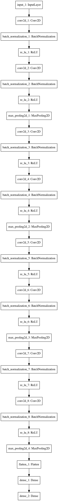
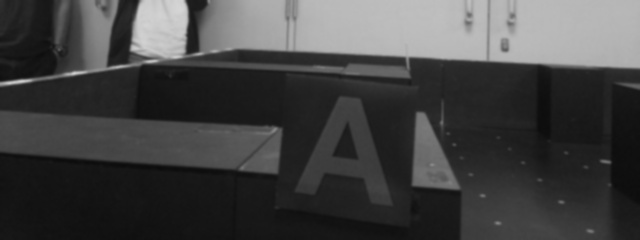
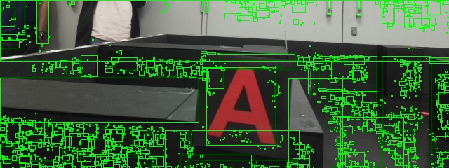
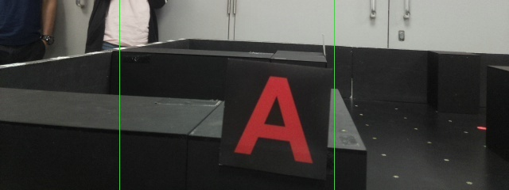

## Convolutional Neural Network Architecture

We had 2 versions of the CNN, one of which accepts grayscale images and the other accepts coloured images. The final one we used for our leaderboard was the **coloured** one. Both of their weights are included in this repository, and both versions used this architecture.

## Classes to detect
              

The [`labelbinarizer.joblib`](./labelbinarizer.joblib) is used to convert the class labels to their respective one-hot labels, and vice versa. 

## Image Processing
The image processing is used to first localize potential targets and to plot the bounding boxes. As the camera is place at a high position, it is able capture our targets and irrelevant noises. Therefore I first crop the image.

Afterwards, the image is converted to grayscale and Gaussian blur is applied to remove background noises.

Next, image thresholding is applied to the blurred grayscale image to partition the image into its background and foreground.

Contours are then extracted from the transformed image which is used to generate all possible bounding boxes.

As there are lots of possibilities and passing each bounding box through the CNN will be inefficient, I first filter these boxes due to some facts that I know of the targets. The bounding boxes should be squarish and cannot be too small.

Each of this bounding boxes are then cropped out, resized and normalized before passing them into the CNN. In this case, the 3 bounding rectangles are being passed into the CNN, which obtains the following output.

`[('a', 1.0), ('up', 0.8698935), ('b', 0.2973201)] `

The predictions are filtered through a threshold value and in this case, "A" is the final prediction.

However, the camera is able to see up to 1 grid behind and ahead of the robot's center point. The position of the final bounding box has to be communicated to the Algorithms subsystem to figure out this image coordinates in the maze. To do this, I partition the image accordingly. In this case, the target is located in the center.

## Communicating with other subsystems
The code in [`main.py`](./main.py) runs a HTTP server and handle requests made by other subsystems. Images received are processed and passed through the CNN, however there may be several detections of the same image class in a maze run. To counter this issue, each unique class is only recorded for the image that provides the **largest bounding box area**.

The `forDebug` and `debugEnd` functions are used to simulate a maze run, to allow me to develop this system without relying too much on the other subsystems. Change the `location` variable to which ever folder that contains the raw images that you collected.